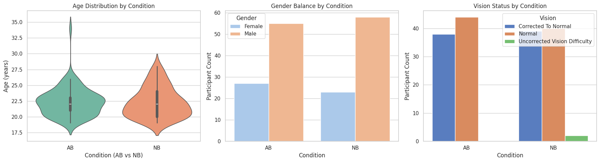
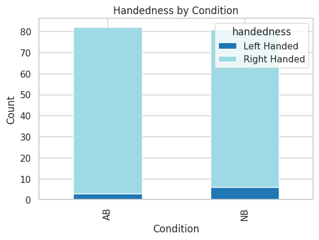
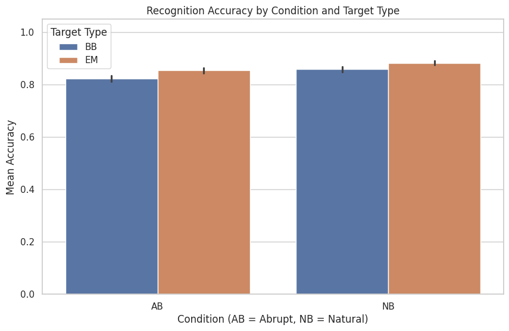
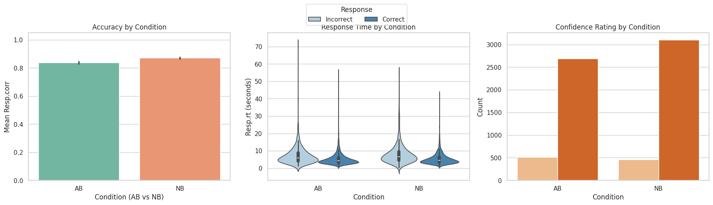
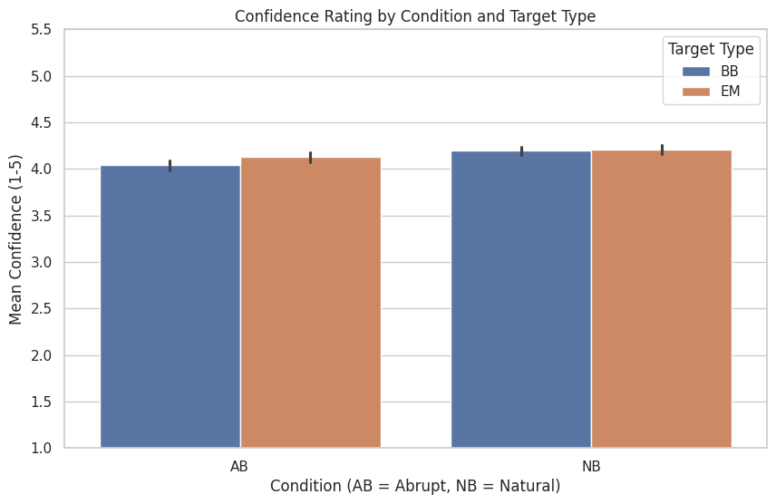
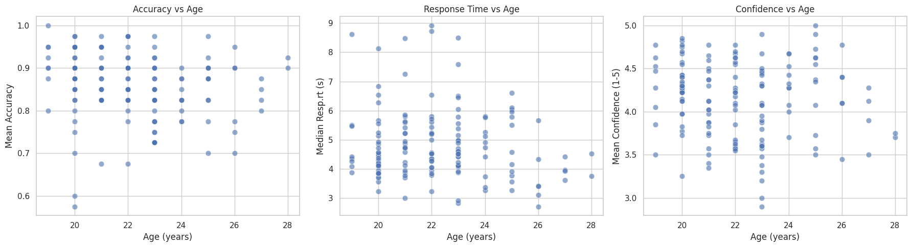
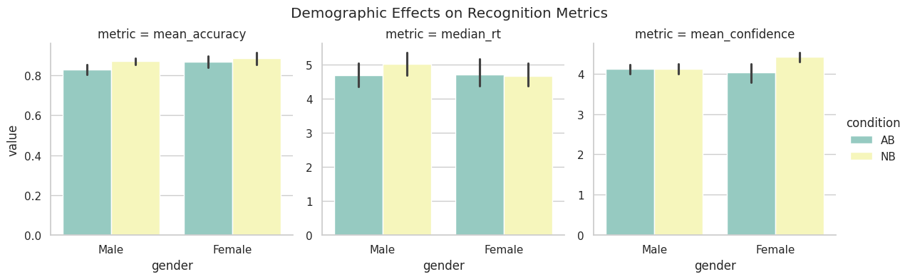

# Report 1 · Exploratory Visualizations for the Movie Memory Study

## Introduction
Abrupt vs. naturalistic film edits modulate how viewers perceive event boundaries, which in turn affects how reliably they encode and later recognize still frames from those movies. Event-segmentation theory predicts that abrupt cuts (AB) can disrupt predictive models and impair recognition, whereas natural boundaries (NB) align with mnemonic expectations and may boost accuracy and confidence. The BRSM Movie Memory dataset captures this phenomenon through a recognition task in which participants encode edited movie clips and later discriminate target frames (either right **b**efore **b**oundaries, BB, or within the **e**vent **m**iddle, EM) from visually similar lures. Understanding how editing style interacts with boundary type informs both cognitive models of memory and practical editing decisions for educational or narrative media.

### Dataset Overview
- **Participants:** Individuals identified as `sub100`–`sub131` completed an encoding session followed by a forced-choice recognition test under either AB or NB viewing conditions.
- **Stimuli:** Movie clips were segmented into BB and EM targets; each recognition trial presented one target-lure pair plus a confidence judgment (1–5) and reaction time (RT).
- **Files:**
  - Recognition-stage logs in `BRSM data csv/` supply per-trial accuracy, RTs, and confidence.
  - `Demographic data.xlsx` contributes age, gender, handedness, and vision metadata.

### Problem Statement
Quantify how editing style (AB vs. NB) and boundary type (BB vs. EM) shape recognition accuracy, response times, and confidence, while accounting for demographic balance and attention compliance. 

## Methods
1. **Data Assembly:** All recognition CSVs were concatenated, filtered to rows with valid button presses, and labeled by participant condition (AB/NB) and target type (BB/EM).
2. **Demographic Merge:** Cleaned demographic columns were standardized and joined back to participant summaries to enable demographic-stratified plots.
3. **Derived Metrics:**
  - Mean accuracy, hit rates, and median RTs per participant and condition.
  - Confidence aggregates (mean and distribution across the 1–5 scale).
  - Participant-level merges that align recognition summaries with demographics for exploratory moderation checks.

## Results and Visual Evidence
### Participant Composition

- Violin and count plots confirm that age, gender, and vision distributions are comparable between AB and NB groups, minimizing demographic confounds prior to the recognition analyses.
- Handedness differences are small, so later performance contrasts are primarily attributable to editing style rather than motor-preference biases.

### Recognition Accuracy and Response Profiles

- NB viewers achieve higher mean accuracy for both BB and EM frames, maintaining a 3–5 percentage point edge over AB viewers while BB vs. EM differences remain minimal inside each condition.
- The multi-panel summary shows that correct responses are consistently faster than incorrect ones, and NB response-time distributions are tighter, indicating more stable decision dynamics under natural edits.
- Confidence counts skew toward higher ratings in both groups, but NB participants register more high-confidence correct responses than AB participants.

### Confidence Distributions by Condition

- Confidence ratings span the full 1–5 scale yet cluster near 4–5, especially for NB viewers; AB confidence exhibits wider error bars, reflecting greater uncertainty under abrupt edits.
- Within each condition, BB and EM bars overlap substantially, so boundary type appears secondary to editing style at this descriptive stage.

### Demographic Effects on Recognition Metrics

- Scatter plots relating age to mean accuracy, RT, and confidence show negligible slopes, implying limited age-based modulation.
- Gender-stratified bars stay within overlapping confidence intervals for all metrics, reinforcing that observed differences stem mainly from AB vs. NB exposure rather than demographic imbalance.

## Preliminary Interpretation
- Naturalistic cuts offer a small but consistent advantage in both accuracy and confidence without meaningfully altering RT distributions.
- Demographic and attention checks rule out common confounds, lending credibility to the editing-style effect.
- Boundary labels (BB vs. EM) contribute minimal variance in this descriptive stage, so additional metrics (e.g., d-prime, hierarchical models) may be needed to isolate boundary sensitivity.

## Future Work
1. **Distribution Checks:** Quantify accuracy and RT distributions for AB vs. NB and BB vs. EM to assess normality and heteroscedasticity.
2. **Inference Pipeline:** Based on distribution diagnostics, run parametric (t-tests/ANOVA) or non-parametric (Mann–Whitney, permutation) tests to evaluate condition differences rigorously.
3. **Signal-Detection Metrics:** Compute d-prime (hit rate - false-alarm rate) per participant and repeat the condition/boundary comparisons to account for response bias.
4. **Multi-level Variability:** Incorporate movie-level or participant-level random effects to model variability and relate confidence ratings to accuracy and RT, clarifying whether elevated confidence drives faster or more accurate responses in specific groups.
