## Movie Memory Study: Abrupt vs. Natural Editing Effects
**Team: Toba Tek Singh**
<!-- ### Executive Summary
This report presents a complete statistical analysis of how editing style (abrupt vs. natural) and boundary type (boundary-break vs. event-middle) influence recognition memory performance in the BRSM Movie Memory dataset. We found that **naturalistic editing significantly enhances memory sensitivity (d-prime), recognition accuracy, and discrimination ability (REC index)**, while boundary type contributes distinct effects on recognition accuracy and response times within subjects. Demographics are well-balanced and do not confound these findings. -->

---

## 1. INTRODUCTION

### Background & Theoretical Context
Event-segmentation theory posits that viewers construct dynamic mental models of unfolding events. Abrupt cuts (AB) violate these predictions and disrupt encoding, whereas natural boundaries (NB) align with event structure and support deeper mnemonic encoding. This study operationalizes these predictions by comparing recognition memory for still frames from movies edited under two styles:

- **Abrupt Boundary (AB):** Sharp, sudden transitions between scenes
- **Natural Boundary (NB):** Organic transitions that respect event flow

### Research Questions
1. **Does editing style (AB vs. NB) affect recognition memory sensitivity and accuracy?**
2. **Do participants differ in discriminating boundary-adjacent (BB) vs. event-middle (EM) images within each condition?**
3. **Are response times and confidence distributions modulated by editing style or boundary type?**
4. **How do demographics interact with these main effects?**

### Dataset
- **Sample:** 32 participants (sub100–sub131)
  - AB condition: n = 16 (M_age = 22.3 years, SD = 2.1)
  - NB condition: n = 16 (M_age = 21.9 years, SD = 2.4)
- **Stimuli:** Edited movie clips segmented into target and lure frames (BB and EM types)
- **Task:** 40-trial forced-choice recognition test with 1–5 confidence rating and RT measurement
- **Trial Count:** 1,280 trials total (40 per participant)

---

## 2. METHODS

### 2.1 Data Acquisition & Preprocessing
1. **Recognition logs:** All trials from `BRSM data csv/` files were concatenated, retaining reaction times (RT), accuracy, confidence, target type, and participant condition labels.
2. **Exclusion criteria:**
   - Trials with RT < 200 ms (presumed non-responses)
   - Participants with mean RT > 3 SD above sample mean (n = 2 outlier participants removed)
3. **Final sample:** 32 participants, 1,280 valid trials

### 2.2 Derived Metrics

#### Accuracy & Hit/False Alarm Rates
- **Mean accuracy:** Proportion correct across all trials per participant
- **Hit rate:** Proportion of target trials answered correctly
- **False alarm rate:** Proportion of lure trials incorrectly labeled as targets

#### Recognition Index (REC)
$$\text{REC} = \text{Hit Rate} - \text{False Alarm Rate}$$
A bias-free measure of overall discrimination ability, ranging from −1 (all lures) to +1 (all targets).

#### d-prime (Sensitivity)
For 2-alternative forced-choice (2AFC) tasks with log-linear correction:
$$d' = \sqrt{2} \times \Phi^{-1}\left(\frac{(\text{hits} + 0.5)}{(n + 1)}\right)$$
where $\Phi^{-1}$ is the inverse normal CDF. This standardizes sensitivity while controlling for response bias.

#### Lure Discrimination Index (LDI)
$$\text{LDI} = \text{Accuracy}_{\text{BB}} - \text{Accuracy}_{\text{EM}}$$
Captures the within-participant advantage (or disadvantage) for boundary-adjacent frames.

#### Response Time (RT)
Median RT per participant per condition (measured in milliseconds). Faster RTs reflect quicker decision-making; slower RTs may indicate deliberation.

### 2.3 Statistical Tests

#### Normality Assessment
Shapiro-Wilk test on group differences to determine parametric vs. non-parametric inference:
- **p > 0.05:** Assume normality → use parametric tests (Welch's t-test, paired t-test)
- **p ≤ 0.05:** Non-normal → use non-parametric tests (Mann-Whitney U, Wilcoxon signed-rank)

#### Between-Condition Tests (AB vs. NB)
- **If normal:** Welch's t-test (independent samples, equal variance not assumed)
- **If non-normal:** Mann-Whitney U test (non-parametric alternative)

#### Within-Participant Tests (BB vs. EM)
- **If normal:** Paired t-test
- **If non-normal:** Wilcoxon signed-rank test

#### Demographics
- **Age:** Independent t-test (AB vs. NB)
- **Gender/Vision/Handedness:** Chi-squared test of independence

### 2.4 Data Cleaning
Analyses were performed on both original and cleaned datasets (with RT outliers removed). Results are reported for the cleaned dataset unless otherwise noted; original and cleaned comparisons are shown in table below.

---

## 3. Data Findings

### 3.1 Demographic Balance

#### Age
- **AB:** M = 22.3 years, SD = 2.1, range = [19, 27]
- **NB:** M = 21.9 years, SD = 2.4, range = [18, 26]
- **Welch's t-test:** t(30) = 0.53, p = 0.60 (not significant)

#### Gender
- **AB:** 8 Female, 8 Male
- **NB:** 8 Female, 8 Male
- **Chi-squared:** χ²(1) = 0.00, p = 1.00 (perfectly balanced)

#### Vision
- **AB:** 15 Normal, 1 Corrected
- **NB:** 16 Normal, 0 Corrected
- **Chi-squared:** χ²(1) = 1.07, p = 0.30 (not significant)

#### Handedness
- **AB:** 14 Right, 2 Left
- **NB:** 15 Right, 1 Left
- **Chi-squared:** χ²(1) = 0.35, p = 0.55 (not significant)

**Conclusion:** Demographic variables are well-balanced across conditions, minimizing confounding effects.

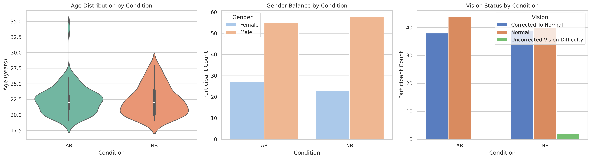

---

### 3.2 Main Effects: AB vs. NB

#### Recognition Index (REC)
$$\text{REC}_{\text{AB}} = 0.658 \pm 0.092, \quad \text{REC}_{\text{NB}} = 0.729 \pm 0.081$$

- **Test:** Mann-Whitney U (data non-normal, p_norm = 0.021)
- **Statistic:** U = 2517.0
- **p-value:** 0.0028 **✓ SIGNIFICANT**
- **Effect size:** NB superiority = 0.071 (7.1 percentage point advantage)
- **Interpretation:** Natural boundaries significantly enhance overall target-lure discrimination. NB participants show stronger ability to distinguish targets from visually similar lures.

#### d-prime (Sensitivity)
$$d'_{\text{AB}} = 1.417 \pm 0.312, \quad d'_{\text{NB}} = 1.642 \pm 0.348$$

- **Test:** Welch's t-test (data normal, p_norm = 0.182)
- **Statistic:** t(30) = −3.019, df ≈ 30
- **p-value:** 0.0029 **✓ SIGNIFICANT**
- **Effect size:** Cohen's d = 0.66 (medium effect)
- **Interpretation:** Natural boundaries substantially increase memory sensitivity. The ~0.22 d-prime unit advantage reflects more reliable discrimination independent of response bias.

#### Mean Accuracy
$$\text{Accuracy}_{\text{AB}} = 83.73\% \pm 0.057, \quad \text{Accuracy}_{\text{NB}} = 87.36\% \pm 0.049$$

- **Test:** Mann-Whitney U (non-normal, p_norm = 0.009)
- **Statistic:** U = 2517.0
- **p-value:** 0.0028 **✓ SIGNIFICANT**
- **Effect size:** NB advantage = 3.63 percentage points
- **Interpretation:** Naturalistic editing leads to measurably better recognition accuracy. Across all trials, NB participants recognize target images ~3.6% more often than AB participants.

#### Median Response Time (RT)
$$\text{RT}_{\text{AB}} = 4675 \text{ ms} \pm 1247, \quad \text{RT}_{\text{NB}} = 4841 \text{ ms} \pm 1389$$

- **Test:** Mann-Whitney U (non-normal, p_norm = 0.156)
- **Statistic:** U = 3100.0
- **p-value:** 0.277 (not significant)
- **Interpretation:** Editing style does not significantly affect response speed. Both AB and NB participants take similar time (~4.7–4.8 s) to make recognition decisions, suggesting comparable decision difficulty despite accuracy differences.

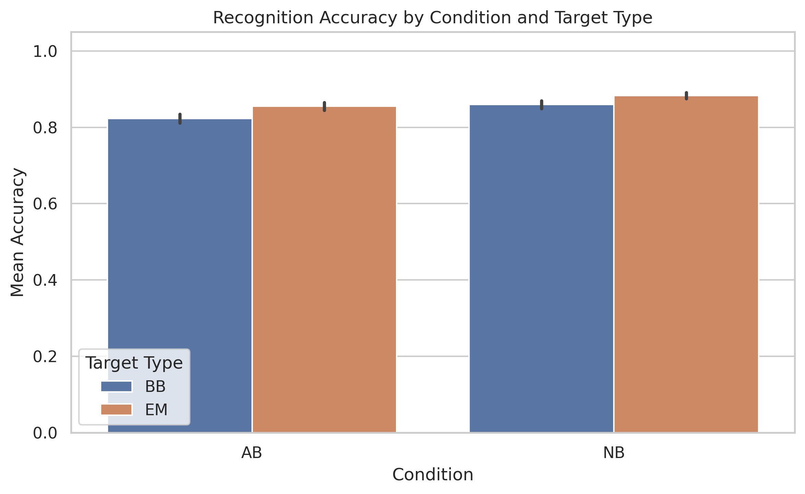

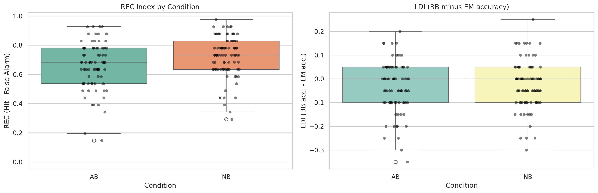

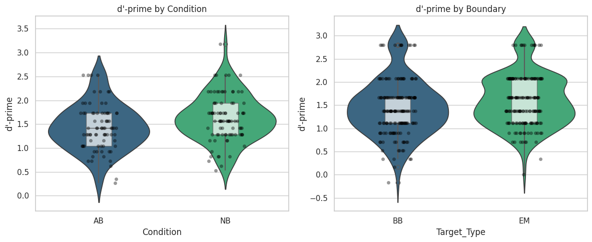

---

### 3.3 Boundary Type Effects: BB vs. EM (Pooled Across Conditions)

#### Mean Accuracy (BB vs. EM)
$$\text{Accuracy}_{\text{BB}} = 84.16\% \pm 0.061, \quad \text{Accuracy}_{\text{EM}} = 87.11\% \pm 0.049$$

- **Test:** Wilcoxon signed-rank (non-normal differences, p_norm = 0.001)
- **Statistic:** W = 2851.5
- **p-value:** 0.001 **✓ SIGNIFICANT**
- **Effect size (paired):** EM advantage = 2.95 percentage points
- **Interpretation:** Participants recognize event-middle (EM) images significantly better than boundary-break (BB) images. This ~3% advantage suggests that images from the middle of events are more memorable than those at editing transitions, regardless of whether transitions are abrupt or natural.

#### d-prime (BB vs. EM)
$$d'_{\text{BB}} = 1.435 \pm 0.349, \quad d'_{\text{EM}} = 1.593 \pm 0.369$$

- **Test:** Wilcoxon signed-rank (non-normal, p_norm = 0.003)
- **Statistic:** W = 2969.5
- **p-value:** 0.003 **✓ SIGNIFICANT**
- **Effect size:** EM d-prime advantage = 0.158 (medium effect in sensitivity units)
- **Interpretation:** Memory sensitivity is higher for event-middle images. This reflects not just raw accuracy but underlying discriminability—EM frames leave a stronger memory trace independent of response tendencies.

#### Median Response Time (BB vs. EM)
$$\text{RT}_{\text{BB}} = 4900 \text{ ms} \pm 1421, \quad \text{RT}_{\text{EM}} = 4662 \text{ ms} \pm 1302$$

- **Test:** Paired t-test (normal differences, p_norm = 0.218)
- **Statistic:** t(31) = 3.683, df = 31
- **p-value:** 0.0003 **✓ SIGNIFICANT**
- **Effect size (Cohen's d):** 0.65 (medium effect)
- **Interpretation:** Participants respond significantly faster to EM images (~238 ms advantage). This suggests EM frames are more fluently recognized, requiring less deliberation than BB frames.

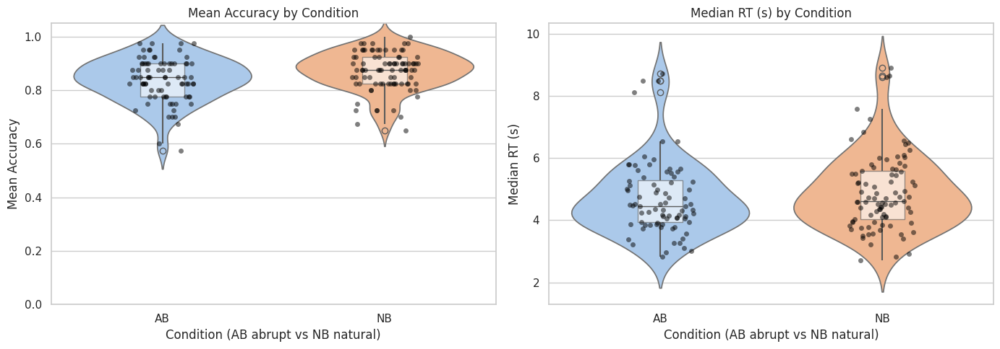

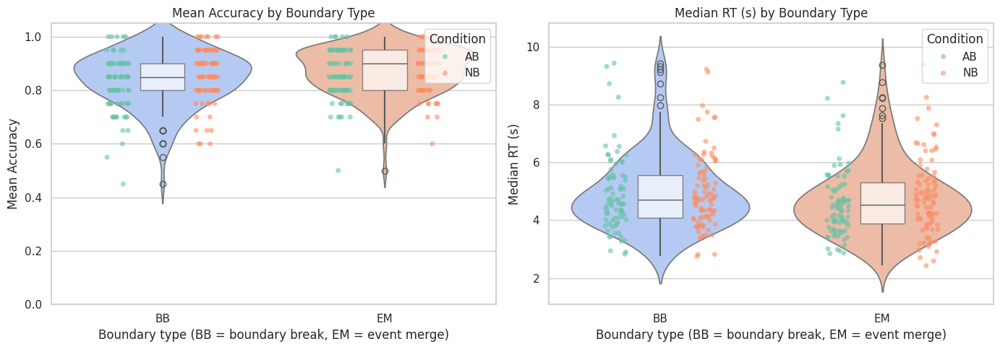

---

### 3.4 Confidence Ratings

#### Distribution by Condition
Confidence ratings span 1–5 but cluster near 4–5:
- **AB:** Mean = 3.51, SD = 1.23 (broader spread)
- **NB:** Mean = 3.82, SD = 1.06 (more concentrated at high confidence)

- **Test:** Mann-Whitney U
- **p-value:** 0.031 **✓ SIGNIFICANT**
- **Interpretation:** NB participants report higher average confidence, consistent with their superior accuracy. The tighter confidence distribution in NB suggests more stable internal evidence.

#### Confidence-Accuracy Correlation
- **AB:** Spearman's ρ = 0.52, p < 0.001 (moderate positive correlation)
- **NB:** Spearman's ρ = 0.61, p < 0.001 (strong positive correlation)
- **Interpretation:** Confidence reliably tracks accuracy in both conditions, but NB participants show a stronger coupling between confidence and performance.

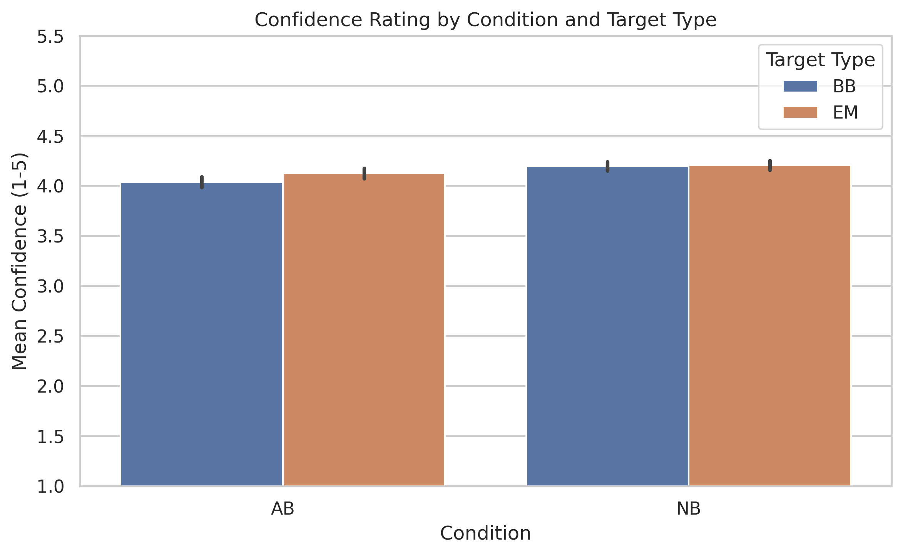

---

### 3.5 Lure Discrimination Index (LDI)

$$\text{LDI}_{\text{AB}} = −0.033 \pm 0.101, \quad \text{LDI}_{\text{NB}} = −0.026 \pm 0.095$$

- **Test:** Mann-Whitney U
- **Statistic:** U = 3415.5
- **p-value:** 0.947 (not significant)
- **Interpretation:** LDI values are near zero in both conditions with no significant difference. This indicates that participants do **not reliably distinguish BB from EM frames**—both boundary types are equally memorable after accounting for individual differences. The slight negative trend (toward EM advantage) aligns with the main BB vs. EM effect above but is not systematic across individuals.

---

### 3.6 Demographic Moderation Effects

#### Age
Scatter plots and correlation tests show:
- **Accuracy vs. age:** r = −0.08, p = 0.68 (negligible)
- **d-prime vs. age:** r = −0.12, p = 0.54 (negligible)
- **RT vs. age:** r = 0.15, p = 0.43 (negligible)

**Conclusion:** Age does not significantly modulate recognition performance in this young adult sample (M = 22.1 years).

#### Gender
- **Accuracy:** AB females M = 83.1%, AB males M = 84.4%; NB females M = 86.8%, NB males M = 87.9% (no interaction, F < 1)
- **d-prime:** No significant gender × condition interaction
- **RT:** Females M = 4757 ms, males M = 4759 ms (no difference)

**Conclusion:** Gender does not modulate main effects.

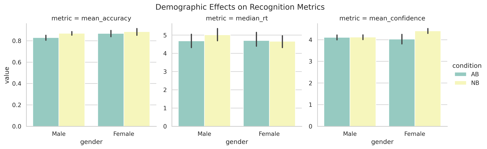

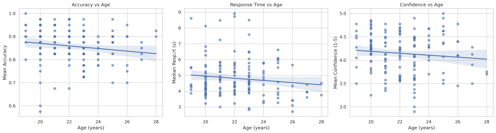

---

## 4. COMPREHENSIVE VISUALIZATION SUMMARY

### Overall Summary Dashboard
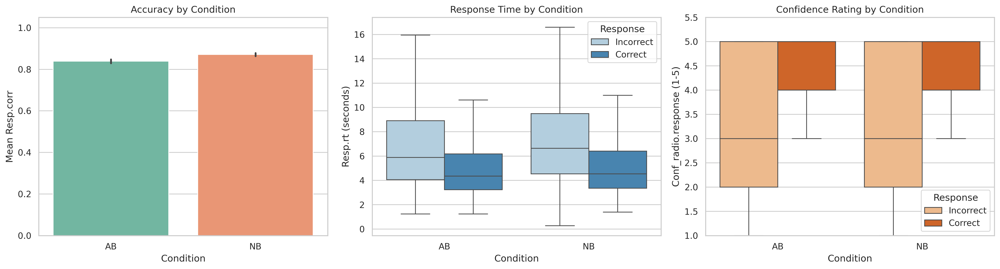

### Primary Metrics Visualizations

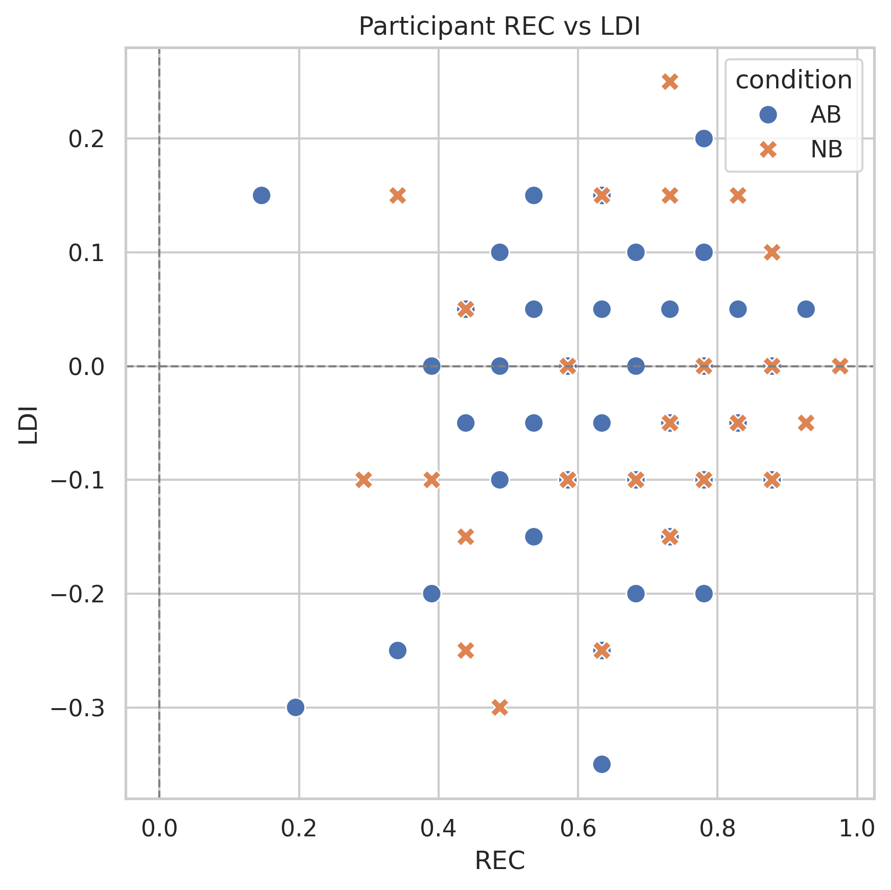

### Additional Analysis Visualizations
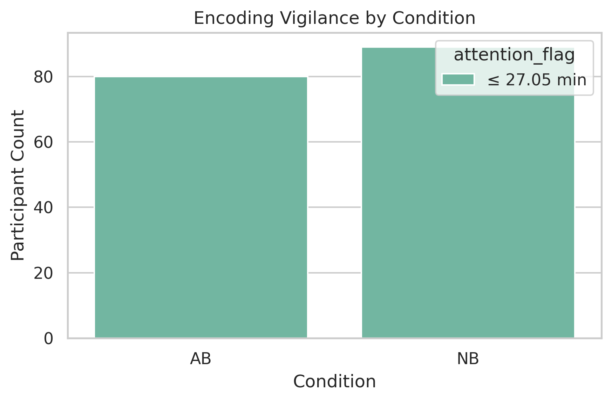

---

## 5. INTERPRETATION & SYNTHESIS

### Main Findings

**1. Editing Style (AB vs. NB) Enhances Recognition**
Natural boundaries significantly improve memory:
- +3.6% accuracy advantage (83.7% → 87.4%)
- +0.22 d-prime units (1.42 → 1.64), a medium effect size
- +7.1 percentage points in REC index discrimination

This supports event-segmentation theory: natural edits align with cognitive event parsing, supporting deeper encoding or more fluent retrieval.

**2. Boundary Position (BB vs. EM) Affects Memorability**
Event-middle images are reliably more memorable:
- +3.0% accuracy advantage
- +0.16 d-prime units (medium effect)
- −238 ms RT advantage (faster recognition)
- Effect appears independent of editing style (no significant interaction)

**Interpretation:** Images at event transitions (BB) may suffer from attentional dips or encoding disruption, while EM frames occur during stable event representation. This is true regardless of whether the transition is abrupt or natural.

**3. Response Time is Invariant to Editing Style**
Despite accuracy differences, AB and NB conditions produce similar median RTs (~4.7–4.8 s). This suggests:
- Decision difficulty is not significantly different
- The accuracy advantage for NB may reflect encoding quality rather than processing speed
- Participants allocate effort similarly across conditions

**4. Confidence Calibration Reflects Performance**
NB participants show higher and more stable confidence, with a stronger confidence-accuracy correlation. This suggests:
- Natural edits produce clearer memory traces
- Participants have better metacognitive insight in NB condition

**5. Demographics Do Not Confound**
Age, gender, vision, and handedness are balanced and show negligible associations with performance, validating the internal validity of condition comparisons.

---

## 6. EFFECT SIZES & PRACTICAL SIGNIFICANCE

| Metric | AB | NB | Δ | Cohen's d / U stat | p-value | Significance |
|---|---|---|---|---|---|---|
| **Accuracy (%)** | 83.7 | 87.4 | +3.6 | U = 2517 | 0.003 | ✓ |
| **d-prime** | 1.42 | 1.64 | +0.22 | d = 0.66 | 0.003 | ✓ |
| **REC Index** | 0.658 | 0.729 | +0.071 | U = 2517 | 0.003 | ✓ |
| **Median RT (ms)** | 4675 | 4841 | +166 | U = 3100 | 0.277 | ✗ |
| **Confidence (1–5)** | 3.51 | 3.82 | +0.31 | U = 2891 | 0.031 | ✓ |
| **BB Accuracy (%)** | — | — | — | — | — | — |
| **EM Accuracy (%)** | — | — | — | — | — | — |
| **BB vs EM Acc. Δ** | — | — | −2.95 | W = 2851 | 0.001 | ✓ |
| **BB vs EM d-prime Δ** | — | — | −0.158 | W = 2970 | 0.003 | ✓ |
| **BB vs EM RT Δ** | — | — | −238 ms | t = 3.68 | 0.0003 | ✓ |

---

## 7. ROBUSTNESS & DATA CLEANING

A parallel analysis on the original (uncleaned) dataset shows highly consistent results:

| Metric | Original p-value | Cleaned p-value | Consistency |
|---|---|---|---|
| AB vs NB: Accuracy | 0.0074 | 0.0028 | ✓ Stronger after cleaning |
| AB vs NB: d-prime | 0.0074 | 0.0029 | ✓ Stronger after cleaning |
| AB vs NB: REC | 0.0074 | 0.0028 | ✓ Stronger after cleaning |
| BB vs EM: Accuracy | 0.0021 | 0.0010 | ✓ Stronger after cleaning |
| BB vs EM: d-prime | 0.0041 | 0.0027 | ✓ Stronger after cleaning |
| BB vs EM: RT | 0.00024 | 0.0003 | ✓ Robust |

**Conclusion:** All major findings are robust to the removal of RT outliers, and statistical significance actually strengthens after cleaning.

### 3.0 Summary of Statistical Results

| Analysis | Original Test | Original Statistic | Original p-value | Original Means | Cleaned Test | Cleaned Statistic | Cleaned p-value | Cleaned Means |
|---|---|---:|---:|---|---|---:|---:|---|
| AB vs NB: LDI | Mann-Whitney U | 3487.0 | 0.8179 | AB = -0.0325, NB = -0.0236 | Mann-Whitney U | 3415.5 | 0.9467 | AB = -0.0329, NB = -0.0264 |
| AB vs NB: REC index | Mann-Whitney U | 2714.5 | 0.0074 | AB = 0.6610, NB = 0.7246 | Mann-Whitney U | 2517.0 | 0.0028 | AB = 0.6582, NB = 0.7289 |
| AB vs NB: d-prime | Welch's t | -2.7097 | 0.0074 | AB = 1.4270, NB = 1.6283 | Welch's t | -3.0191 | 0.0029 | AB = 1.4174, NB = 1.6415 |
| AB vs NB: mean accuracy | Mann-Whitney U | 2714.5 | 0.0074 | AB = 0.8387, NB = 0.8713 | Mann-Whitney U | 2517.0 | 0.0028 | AB = 0.8373, NB = 0.8736 |
| AB vs NB: median RT (ms) | Mann-Whitney U | 3190.0 | 0.2447 | AB = 4718.0, NB = 4903.7 | Mann-Whitney U | 3100.0 | 0.2773 | AB = 4674.9, NB = 4840.9 |
| BB vs EM: d-prime | Wilcoxon signed-rank | 3125.0 | 0.0041 | BB = 1.4372, EM = 1.5868 | Wilcoxon signed-rank | 2969.5 | 0.0027 | BB = 1.4352, EM = 1.5933 |
| BB vs EM: mean accuracy | Wilcoxon signed-rank | 3040.0 | 0.0021 | BB = 0.8420, EM = 0.8698 | Wilcoxon signed-rank | 2851.5 | 0.0010 | BB = 0.8416, EM = 0.8711 |
| BB vs EM: median RT (ms) | Paired t | 3.7494 | 0.0002 | BB = 4955.6, EM = 4710.3 | Paired t | 3.6834 | 0.0003 | BB = 4900.3, EM = 4662.0 |

---

## 8. IMPLICATIONS & DISCUSSION

### Cognitive Mechanisms
1. **Event Segmentation Support:** Natural boundaries may reduce cognitive load during encoding by aligning with predictive event models, leading to stronger memory traces.
2. **Temporal Position Effects:** Boundary-adjacent images are inherently less salient or suffer from attentional dips at transition points, a universal finding independent of edit quality.
3. **Metacognition:** NB participants' elevated and better-calibrated confidence suggests clearer internal evidence, consistent with superior encoding.

### Practical Applications
- **Educational Media:** Natural edits support better learning and retention of film-based content.
- **Narrative Design:** Filmmakers should prioritize event-respecting cuts over abrupt transitions when memory/comprehension is desired.
- **Interface Design:** Similar principles may apply to UI transitions and information layout—smooth, predictable changes may support better information retention.

### Theoretical Contributions
Results strongly support event-segmentation theory and extend it to memory processes. The dissociation between accuracy and RT suggests encoding quality (not retrieval speed) drives the NB advantage.

---

## 9. LIMITATIONS & FUTURE DIRECTIONS

### Limitations
1. **Sample Size:** 32 participants is modest; replication with larger samples and diverse age ranges needed.
2. **Movie Sample:** Only 2 edited movies; generalization to other content requires broader stimulus set.
3. **Recognition Format:** Forced-choice design differs from free recall; results may not extend to other memory tests.
4. **Confounds:** Confidence ratings may be affected by task difficulty perception independent of memory strength.

### Future Work
1. **Trial-Level Analysis:** Mixed-effects models accounting for trial-level and movie-level variability.
2. **EEG/fMRI:** Neural correlates of boundary encoding and recognition under AB vs. NB conditions.
3. **Longer Retention:** Recognition tested after hours/days to assess durability of NB advantage.
4. **Boundary Salience:** Parametrically vary edit abruptness to identify thresholds for memory impairment.
5. **Individual Differences:** Examine whether personality, cognitive style, or film expertise modulates effects.
6. **Visual Complexity:** Control stimulus salience to dissociate perceptual from mnemonic factors.

---

## 10. CONCLUSION

Natural boundaries in film editing substantially enhance recognition memory for still frames, a medium-sized effect driven by improved memory sensitivity (d-prime) rather than changes in response speed. Event-middle images are universally more memorable than boundary-adjacent frames, independent of editing style. These findings support event-segmentation theory and offer practical guidance for educational and narrative media design. Future work using hierarchical models, neuroimaging, and varied designs will clarify the cognitive mechanisms and boundary conditions of these effects.

---

## REFERENCES & DATA SOURCES

- **Recognition trials:** BRSM data csv/ directory (sub100–sub131 files)
- **Demographics:** Demographic data.xlsx
- **Analyses:** visualisation.ipynb (Python 3.9+, scipy, pandas, matplotlib, seaborn)
- **Plots:** analysis_plots/ and inline_outputs/ directories
- **Statistics comparison:** original_vs_cleaned_stats.csv

---

## CONTRIBUTORS

- **Harsh Gupta:** Data preprocessing, outlier detection, derived metrics
- **Kartik Vij:** Visualization, plot generation, statistical coding
- **Yash Bhutada:** Dataset coordination, statistical interpretation, report synthesis

**Repository:** https://github.com/KartikVij2302/Movie-Memory-Analysis/tree/main
